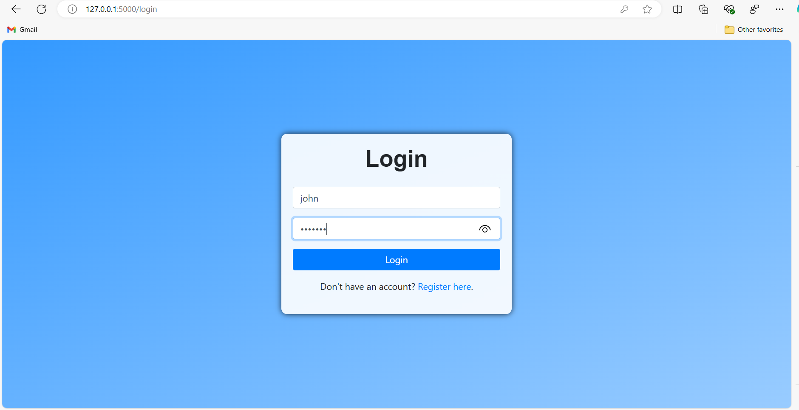
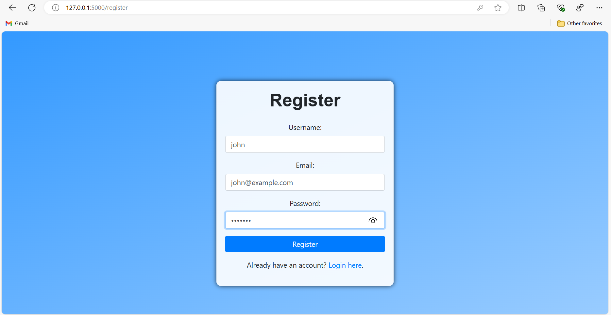
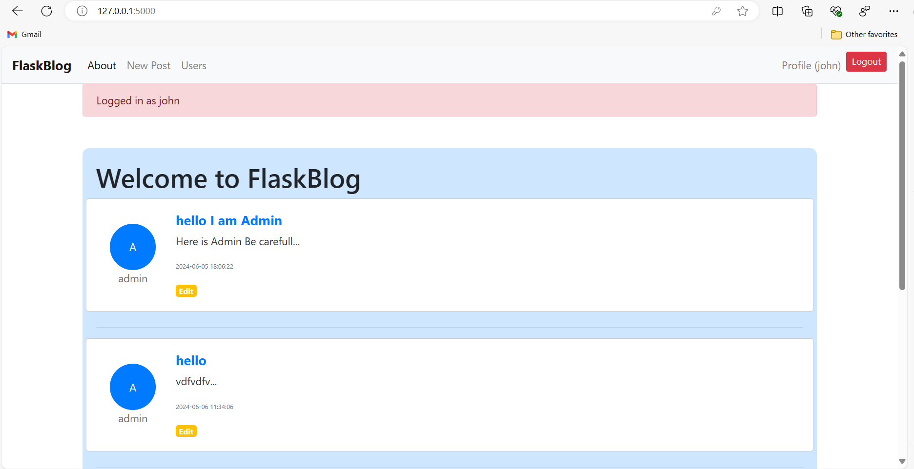
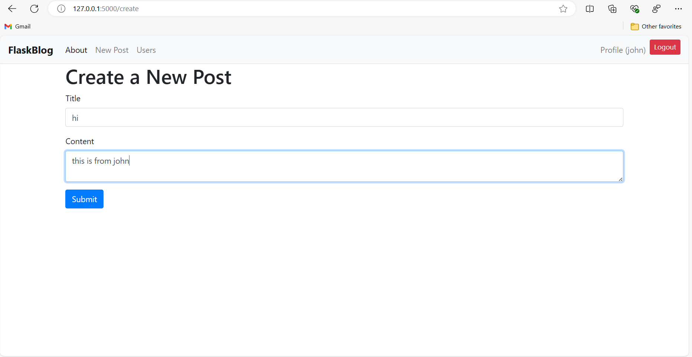
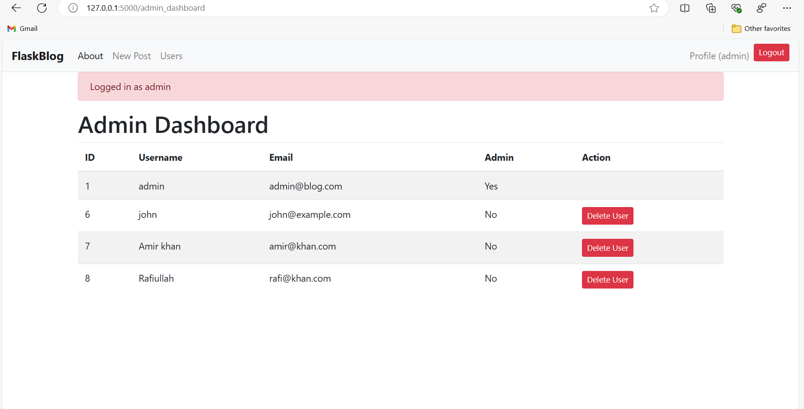
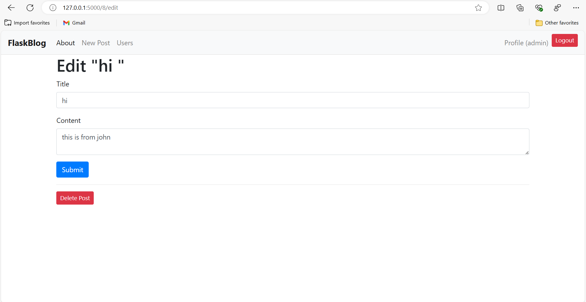

# Flask Blog Application

This is a Flask-based blog application developed as part of a Python course final exam and homework. The application allows users to register, log in, create posts, and includes an admin interface for user management.

## Features

- User registration and authentication
- Blog post creation, editing, and deletion
- Admin interface for user management and post moderation
- Responsive design with custom CSS

## Installation and Setup

1. Clone the repository:
2. Create a virtual environment and activate it:
   python -m venv venv
          source venv/bin/activate  # On Windows use venv\Scripts\activate

3. Install the required packages:
   pip install -r requirements.txt
   
4. Initialize the SQLite database:
   python init_db.py
   Note: This step is crucial. Make sure to run init_db.py before starting the application.
5. Run the application:
   python app.py

6. Access the application in your web browser at `http://localhost:5000`

## Requirements

The following packages are required to run this application:

- Flask==2.1.0
- Werkzeug==2.0.3
- Jinja2==3.0.3
- itsdangerous==2.0.1
- click==8.0.4
- MarkupSafe==2.1.1

You can install these packages using the provided requirements.txt file.

## Admin Access

To access the admin interface, use the following credentials:
- Username: admin
- Email: admin@blog.com
- Password: 123456

As an admin, you can:
- View all users
- Delete users
- Edit or delete any post

## Technologies Used

- Python
- Flask
- SQLite
- JS
- HTML/CSS

## Screenshots

Below are some screenshots of the application in action:

|  |  |
|:--------------------------------------------------------------------------------:|:--------------------------------------------------------------------------------:|
| Caption: The user login interface                                                | Caption: The user register interface                                              |

---
|  |  |
|:----------------------------------------------------------------------------------:|:------------------------------------------------------------------------------------------:|
|                      Caption: The user main screen interface                       |                            Caption: The user add post interface                            |

---
|  |  |
|:----------------------------------------------------------------------------------------:|:------------------------------------------------------------------------------------------:|
|             Caption: Admin interface for user management and post moderation             |                  Admin interface for user management and post moderation                   |

---

## Author

Rezwanullah Khan

## License

This project is licensed under the MIT License - see the [LICENSE](LICENSE) file for details.
